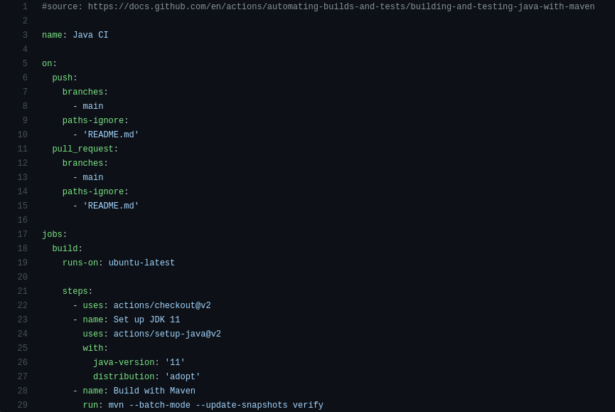
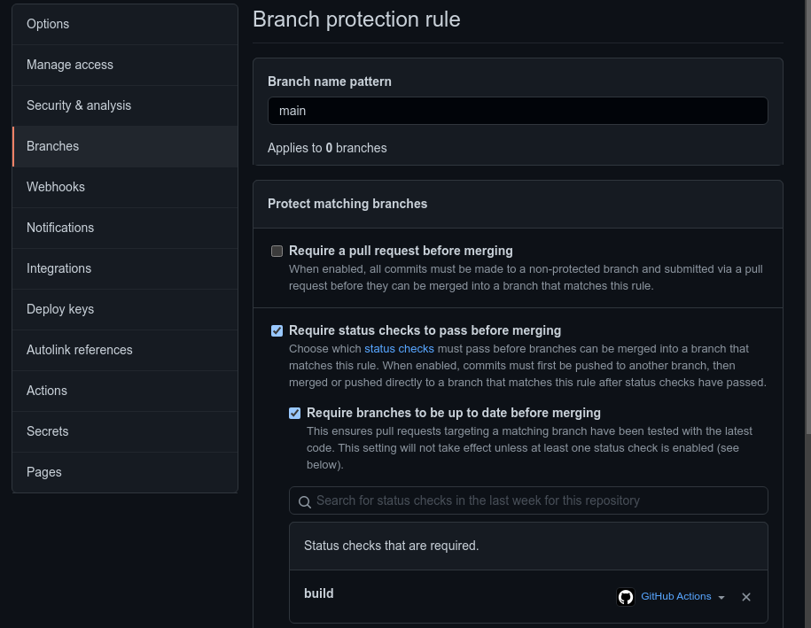
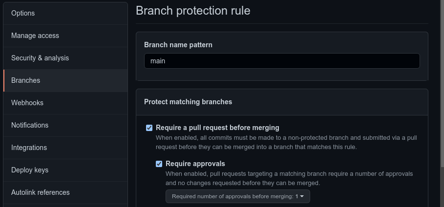
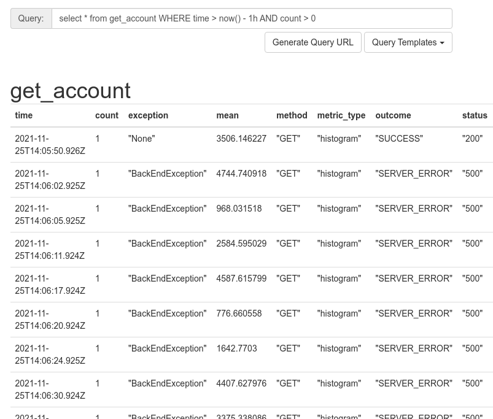
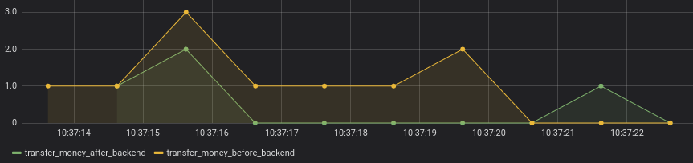

[](https://github.com/l4rma/pgr301_H21_2005/actions/workflows/maven.yml)
[](https://github.com/l4rma/pgr301_H21_2005/actions/workflows/terraform.yml)
[](https://github.com/l4rma/pgr301_H21_2005/actions/workflows/dockerize.yml)

# Eksamen - DevOps
PGR301 Høst 2021

## Oppgave - DevOps

### Drøft:

### 1.1
Q: Beskriv med ord eller skjermbilder hvordan man kan konfigurere GitHub på en
måte som gir bedre kontroll på utviklingsprosessen. Spesielt med tanke på å
hindre kode som ikke kompilerer og feilende tester fra å bli integrert i main
branch.

A: Det første som må gjøres er å sette opp en workflow med github actions.
Dette gjøres ved å legge til directoryet ".github/workflows". Her oppretter man en
yml-fil med instruksjoner for github actions. Instruksjonene inneholder navn,
når, hva, hvor, hvordan alt skal gjøres (bilde 1.1). Dette vil på hver push
bygge applikasjonen og kjøre testene. Github action vil registrere om testen
godkjennes eller ikke. Dette gjør det mulig å gå til Settings/Branches og ved
Branch Protection Rules trykke add og legge til en "rule" på main som sier
"Require status checks to pass before merging" (bilde 1.2). Deretter velger man
bygg, og koden vil nå ikke la seg merge til main hvis testene ikke passerer.


bilde 1.1


bilde 1.2

### 1.2
Q: Beskriv med ord eller skjermbilder hvordan GitHub kan konfigureres for å
sikre at minst ett annet medlem av teamet har godkjent en pull request før den
merges.

A: For å gjøre dette kan man gå til Settings/Branches og ved "Branch Protection
Rules" klikk add. Velg "Require a pull request before merging" og "Require
approvals". Under kan man velge antall approvals som trengs (bilde 2).


bilde 2

### 1.3
Q: Beskriv hvordan arbeidsflyten for hver enkelt utvikler bør være for å få en
effektiv som mulig utviklingsprosess, spesielt hvordan hver enkelt utvikler bør
jobbe med Brancher i Github hver gang han eller hun starter en ny oppgave.

A: For at det ikke skal bli rot og kaos, som hos SkalBank, er det viktig å holde
main branch så clean som mulig. Alt som merges til main bør kjøre tester uten
feil for ikke å skape problemer på main. Derfor bør man alltid, når man skal
legge til kode, først opprette en ny branch der man kan jobbe. Så kan man ved
hjelp av en workflow i github actions automatisere bygging og testen, slik
beskrevet i oppgave 1.1 og kun godta merging dersom testene har passert. Man 
kan også, som beskrevet i oppgave 1.2, legge til en branch protection som sier 
at en eller flere person på teamet må godkjenne koden før den kan merges. 
Da vil sjangsen for uoppdagede feil minske. Brancher bør navngis så det er
enkelt å forstå hva som jobbes med på branchen. Som med alt i IT er det mange
meninger om hva som er den beste navn-konvensjonen her er noen eksempler: 

\<gruppe\>/\<branch-navn\> - \<utvikler\>\_\<branch-type\>\_\<branch-navn> - \<branch-type\>/\<branch-navn\>
```
group1/loginModule
glenn_wip_exam_grading_automator
feature/coolButtons
fix/all_users_get_admin_privliges
```

### 2 
Q: SkalBank har bestemt seg for å bruke DevOps som underliggende prinsipp for
allsystemutvikling i banken. Er fordeling av oppgaver mellom API-teamet og
"Team Dino"problematisk med dette som utgangspunkt? Hvilke prinsipper er det
som ikke etterleves her? Hva er i så fall konsekvensen av dette?

A: Hva DevOps egentlig er kan være litt vagt, men det handler blandt annet om
flyt. Det vil si prinsipper som fjerne "waste" i verdikjeden, færrest mulig
overleveringer og identifisere flaskehalser. Kontinuelig itegrasjon,
kontinuerlige leveranser og automatiserte tester. Alle disse er prinsipper som
SkalBank ikke etterlever. Og konsekvensen av endringen til SkalBank er nok
dessverre at 100+ stillinger (Team Dino) blir overflødige. Det API-teamet vil
gjøre er å sette opp en pipeline hvor blandt annet bygging og testing av kode
er automatisert. Feks på samme måte som vist i neste oppgave.

## Oppgave - Pipline

Fil: .github/workflows/maven.yml

* [x] 3.1 Kjører enhetstester
* [x] 3.2 Kompilerer koden
* [x] 3.3 Bygger artifakt (JAR)

## Oppgave - Feedback

### 4.1 
Q: Applikasjonen skal produsere metrics med Micrometer og levere metrics til
Influx DB lokalt

* [x] Lagt til kode som registerer målepunkter i applikasjonen 

Fil: src/main/java/com/pgr301/exam/BankAccountController.java

I DevOps ånd valgte jeg å bruke litt (for mye) tid på å skrive et shell script
for å sende requester, slik at jeg slapp å gjøre det manuelt igjen og igjen
eller styre med Postman. Har lagt det med i repo (doRequests.sh). 
Dette kan også brukes av sensor for å gjøre requester under testingen :)

### 4.2 
Q: Hvor ofte kaster APIet "BackEndException"? Hvilke spørringer kan sensor 
gjøre mot InfluxDB for å analysere problemet?


Spørringsforslag til influxDB: 
```sql
SELECT * FROM <measurement> WHERE TIME > NOW() - 1h AND COUNT > 0
```
Measurements: ``get_account`` ``transfer_money`` ``update_account``
``get_account_after_backend``  ``transfer_money_after_backend``
``update_account_after_backend``

Spørringene viser henholdsvis requests til de tre endepunktene gjort siste timen.
Da det er en egen kolonne "exceptions" kan man veldig lett se hvilke exceptions
som skjer og når (Bilde 4.1). Her ser man at ved 10 get kall, var det kun ett 
som ikke feilet. Med tanke på statistikk er selvfølgelig 10 forsøk en alt for 
liten prøvemengde, men jeg mener det er nok for å få frem poenget at exceptionen
skjer **altfor ofte**. 

### 4.3
Q: Bruk Micrometer rammeverket til å identifisere problemområdet til applikasjonen.

Jeg la i hver av api-metodene en registrering før
og etter metoden til shaky core system skjer (``..._before_backend`` og 
``..._after_backend``), slik at man kan pin pointe om denne mystiske
BackEndException skjer hos API-teamet eller kjernesystemet. Bilde4.2 er et
screenshot fra Grafana der det er gjort ti kall og man ser at "before" har
blitt registrert ti ganger, mens after kun har blitt registrert tre ganger.
_Det vil si at alle feil må ha skjedd et sted i kjernesystemet._
Det er tid på x-aksen og antall registreringer på y-aksen.
(Det er ikke verdens beste grafiske fremstilling, men jeg mener det kommer
ganske tydelig frem hva som skjer). Det ser ikke bra ut for kjernesystem-teamet.

Jeg har valgt å bare kjøre ti kall siden det var enkelt og greit å
illustrere. Om Jens vil ha det mer nøyaktig er det bare å endre N-verdien i
shell-scriptet til så mye man vil og kjøre en SQL spørring som summerer antall
counts av before\_backend og minuse summen av counts av after\_backends for å 
få antall ganger applikasjonen feilet.


bilde 4.1


bilde 4.2

## Oppgave - Terraform


### 5.1 Drøft:

Q: Hvorfor funket terraformkoden i dette repoet for "Jens" første gang det ble
kjørt? Og hvorfor feiler det for alle andre etterpå, inkludert Jens etter at
han ryddet på disken sin og slettet terraform.tfstate filen?

A: Første gang han kjørte koden fungerte det, siden det ikke er feil i koden,
og det ble det opprettet en statefil med all informasjonen terraform trenger.
Hvis alle de andre kjører nøyaktig samme kode, så vil den feile siden de alle
prøver å opprette buckets med samme navn. S3 buckets trenger globalt unike
navn, så de må endre på navnet (i linje 1 som feilmeldingen sier) for å få det
til å kjøre.

Tfstate-filen Jens slettet er liksom hjernen til terraform. Det er denne som
blir brukt når terraform skal sammenligne terraform koden som blir applyet
med den faktiske infrastrukturen. Når denne blir slettet ved ikke terraform
lenger hva som er hva, Og det vil feile. 

* [x] 5.2 Lag en S3 bucket i klassens AWS konto

### 5.3 Hvordan lage bucket fra CLI? 
Først er sensor nødt til å skaffe seg no nøkler og credentials. For å gjøre
dette må man logge inn på aws console og søke på "IAM". Der vil man på høyre
siden fine "users", klikk på denne for å se en liste med IAM users. Klikk inn
på din bruker og videre på "Security Cridentials" og klikk på knappen 
"Create Access Key". Den finnes rett under der det står at access key brukes
blandt annet til å logg inn på AWS CLI. Så er det bare å pugge secret access 
keyen for den vil du ikke få se igjen. Evt kan du laste ned en .csv fil der 
det står skrevet ned.

Deretter kan sensor konfigurere aws klienten med sin nyanskaffede nøkkel-id
og secret access key

```shell
$ aws configure
```

Så er det bare å bruke s3apiet for å lage seg en bøtte:

```shell 
$ aws s3 mb s3://<bucket_navn> --region <region>
```

* [x] 5.3 Bruk S3 backend for state

### 5.4 Terraformkode

* [x] Lag Terraform kode som oppretter ECR repository

### 5.5 Terraform i pipline

Implementer en workflow med GitHub actions som:

* [x] kjører ``Terraform init & apply`` for hver endring av kode i main branch.
* [x] kjører ``Terraform init & plan`` for hver pull request som lages mot main branch
* [x] feiler dersom Terraformkode som pushes til main ikke er riktig formatert.
* [x] bare kjører dersom det er endringer in ifra/ katalogen.

### 5.6 Forklaring til sensor som vil lage fork

Q: Beskriv hva sensor må gjøre etter han/hun har laget en fork for å få
pipeline til å fungere for i sin AWS/gitHub konto.
Hvilke verdier må endres i koden?
Hvilke hemmeligheter må legges inn i repoet. Hvordan gjøres dette?

A: Først kan sensor endre litt i filene "infra/provider.tf" og
"infra/ecr\_repo.tf". Evt kan også bucket endres til bucketen sensor lagde 
fra kommandolinjen tidligere. //TODO: lage variables.tf
```terraform
  backend "s3" {
    bucket = "pgr301-lama003-terraform"
    key = "<ønsket-filnavn-på-statefil>"
    region = "eu-west-1"
  }
```
```terraform
  resource "aws_ecr_repository" "student_repo" {
    name = "<ønsket-navn-på-ecr-repo>" 
  }
```
Så må sensor legge inn secrets i github repo sitt. Dette gjøres ved å gå inn
på settings, der sensor var for å fikse branch protection. Men nå må sensor
trykke på secrets litt lenger ned på menyen til høyre i stedet for branches.
Her finnes en knapp som sier "New repository secret". Nå er det viktig at 
sensor ikke har glemt nøkkel-iden og secreten han brukte for å konfigurere
aws klienten sin da han lagde bucket, for nå trengs de igjen! 
Klikk på "New repository secret" og legg inn nøkkel-id, viktig at den heter
``AWS_ACCESS_KEY_ID``, og secret access key som må hete
``AWS_SECRET_ACCESS_KEY``. Grunnen til at de må hete dette er at det er disse
navnene som refereres til i ".github/workflows/terraform.yml".

## Oppgave - Docker

* [x] 6.1 Dockerfile (skal både kompilere, bygge og kjøre applikasjonen.

Q: Hva vil kommandolinje for å bygge et container image være?

A: ``$ docker build -t <image-navn>``

Q: Hva vil kommando for å starte en container være? Applikasjonen skal lytte på port 7777 på din
maskin

A: ``$ docker run -p7777:8080 <image-navn>:latest``

Q: Medlemmer av "Team Dino" har av og til behov for å kjøre to ulike versjoner av applikasjonen lokalt på maskinen sin, samtidig .Hvordan kan de gjøre dette uten å få en port-konflikt? Hvilke to kommandoer kan man kjøre for å starte samme applikasjon to ganger, hvor den ene bruker port 7777 og den andre 8888?

A: 
```shell
$ docker run <image-navn> -p7777:8080 
$ docker run <image-navn> -p8888:8080
```
(Evt kan man skrive alt på en linje med "&&" i mellom)
//TODO: dobbelt sjekk at man kan kjøre med "&&"

### 6.2 Lag en GitHub Actions workflow som bygger et Docker image av Spring Boot applikasjonen.
* [x] GitHub Workflowen skal kjøres ved hver push til main branch.
* [x] Hvert Container image skal ha en unik tag som identifiserer hvilken commit i GitHub som ble brukt som grunnlag for å bygge container image.
* [x] Container image skal pushes til ECR repository som ble laget i Terraform oppgaven.

